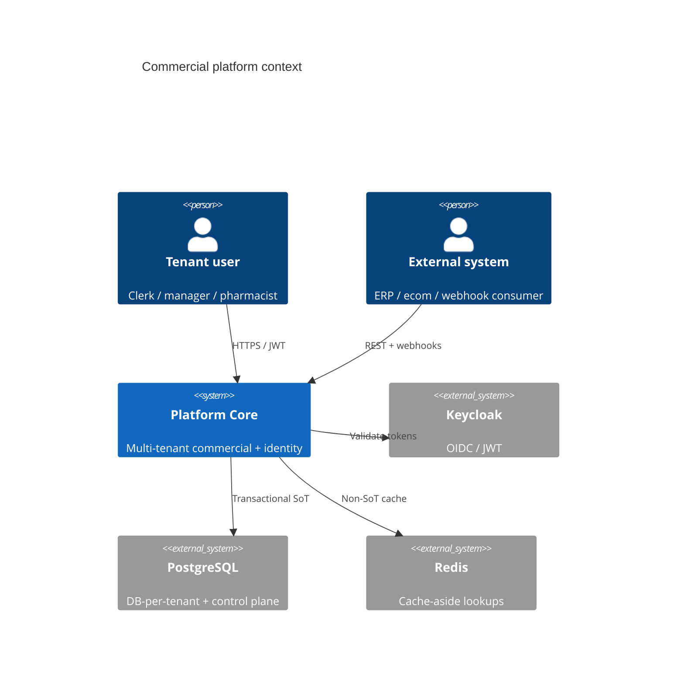
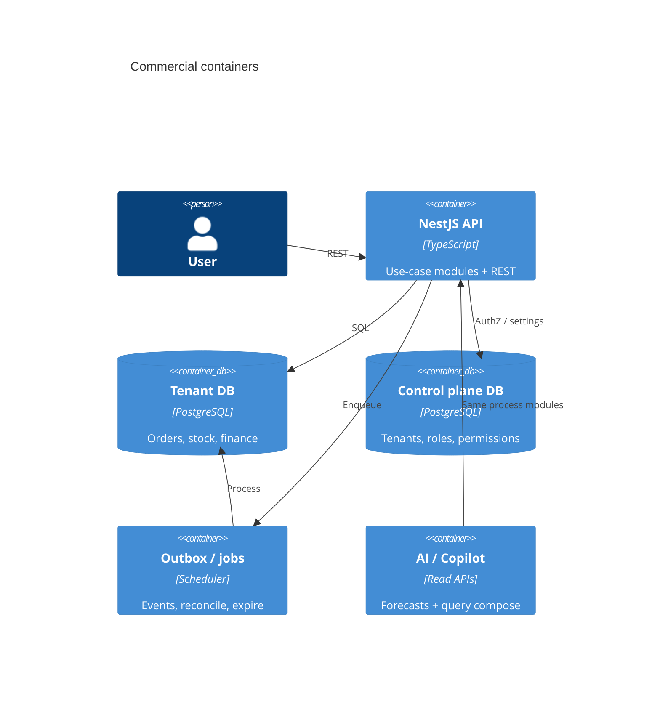
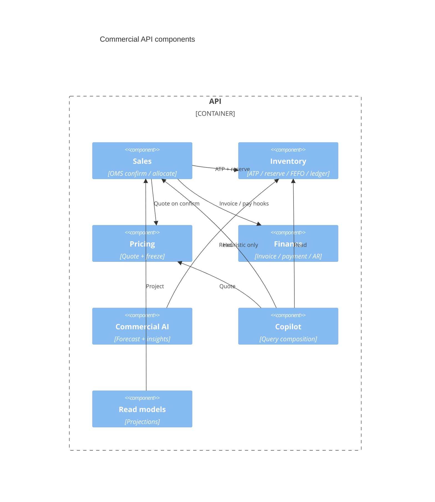

# Commercial C4

## Context

```mermaid
C4Context
    title Commercial platform context
    Person(user, "Tenant user", "Clerk / manager / pharmacist")
    Person(integrator, "External system", "ERP / ecom / webhook consumer")
    System(platform, "Platform Core", "Multi-tenant commercial + identity")
    System_Ext(keycloak, "Keycloak", "OIDC / JWT")
    System_Ext(pg, "PostgreSQL", "DB-per-tenant + control plane")
    System_Ext(redis, "Redis", "Cache-aside lookups")
    Rel(user, platform, "HTTPS / JWT")
    Rel(integrator, platform, "REST + webhooks")
    Rel(platform, keycloak, "Validate tokens")
    Rel(platform, pg, "Transactional SoT")
    Rel(platform, redis, "Non-SoT cache")
```

## Container

```mermaid
C4Container
    title Commercial containers
    Person(user, "User")
    Container(api, "NestJS API", "TypeScript", "Use-case modules + REST")
    ContainerDb(tenantDb, "Tenant DB", "PostgreSQL", "Orders, stock, finance")
    ContainerDb(cpDb, "Control plane DB", "PostgreSQL", "Tenants, roles, permissions")
    Container(outbox, "Outbox / jobs", "Scheduler", "Events, reconcile, expire")
    Container(ai, "AI / Copilot", "Read APIs", "Forecasts + query compose")
    Rel(user, api, "REST")
    Rel(api, tenantDb, "SQL")
    Rel(api, cpDb, "AuthZ / settings")
    Rel(api, outbox, "Enqueue")
    Rel(outbox, tenantDb, "Process")
    Rel(ai, api, "Same process modules")
```

## Component (commercial slice)

```mermaid
C4Component
    title Commercial API components
    Container_Boundary(api, "API") {
      Component(sales, "Sales", "OMS confirm / allocate")
      Component(inv, "Inventory", "ATP / reserve / FEFO / ledger")
      Component(price, "Pricing", "Quote + freeze")
      Component(fin, "Finance", "Invoice / payment / AR")
      Component(ai, "Commercial AI", "Forecast + insights")
      Component(copilot, "Copilot", "Query composition")
      Component(rm, "Read models", "Projections")
    }
    Rel(sales, price, "Quote on confirm")
    Rel(sales, inv, "ATP + reserve")
    Rel(sales, fin, "Invoice / pay hooks")
    Rel(copilot, sales, "Read")
    Rel(copilot, inv, "Read")
    Rel(copilot, price, "Quote")
    Rel(ai, inv, "Heuristic only")
    Rel(rm, sales, "Project")
```
